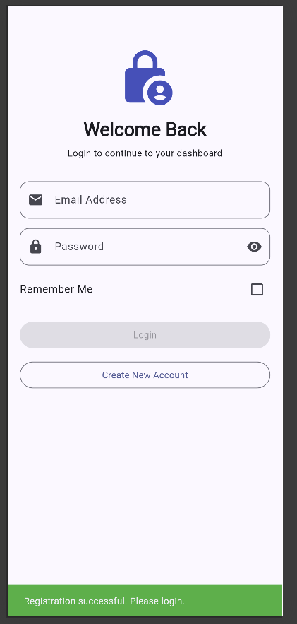
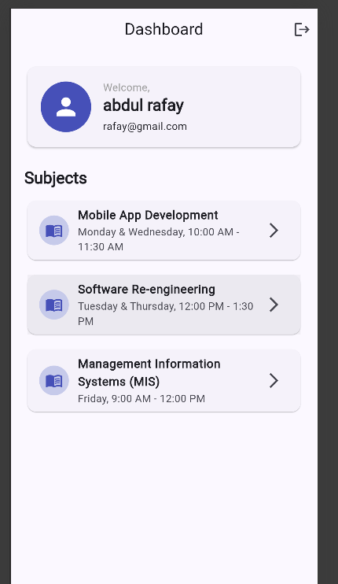
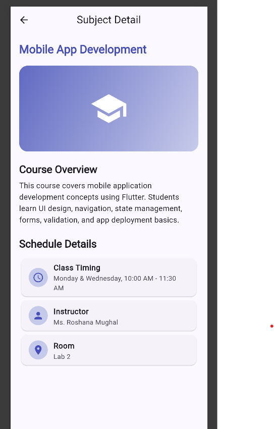
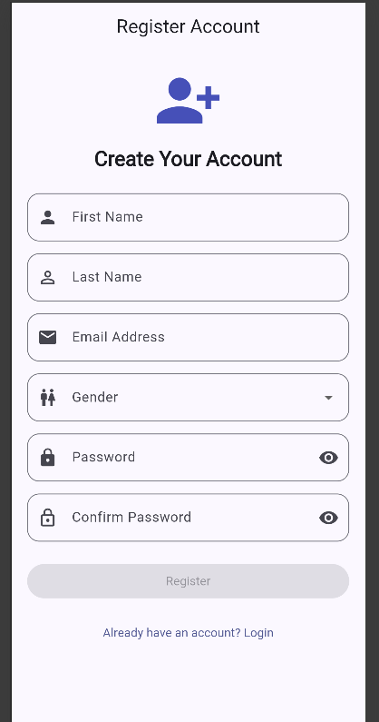
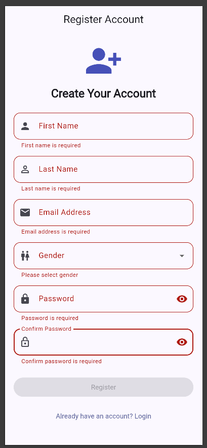

# Flutter Authentication App — CRUD API, Offline Support & State Management Upgrade

A Flutter multi-screen application featuring user authentication, form validation, CRUD API integration, offline support, persistent local storage, improved state management, and repository pattern architecture.

---

## Branch

**`feature/offline-cache-and-state-manangement`**

---

## Assignment Overview

This project is an extension of the previously completed Flutter CRUD API integration assignment.

In this extension, the application has been upgraded with:

* Offline data persistence
* Local course caching
* Improved state management
* Repository pattern
* Optimistic UI updates
* Pull-to-refresh
* Search/filter functionality
* Loading, success, error, and empty state handling

---

## API Used

**JSONPlaceholder** — Free fake REST API for testing and prototyping
🔗 https://jsonplaceholder.typicode.com
📖 Documentation followed: https://jsonplaceholder.typicode.com/guide

The app uses the `/posts` endpoint as "courses":

| Operation     | Method | Endpoint           |
| ------------- | ------ | ------------------ |
| Fetch Courses | GET    | `/posts?_limit=10` |
| Add Course    | POST   | `/posts`           |
| Update Course | PUT    | `/posts/{id}`      |
| Delete Course | DELETE | `/posts/{id}`      |

---

## Tools and Packages Used

* Flutter
* Dart
* HTTP package for REST API calls
* Hive for local offline storage
* Hive Flutter for Flutter integration with Hive
* Connectivity Plus for checking internet/network availability
* ChangeNotifier for state management
* SharedPreferences for authentication/session persistence

---

## Features

### Authentication Features

* User registration with validation
* Login with validation
* Remember Me functionality
* Session persistence using SharedPreferences
* Dashboard navigation after successful login
* Logout functionality

---

### CRUD API Features

* Fetch courses from JSONPlaceholder API
* Display course ID, title, and description
* Add new course using POST request
* Edit existing course using PUT request
* Delete course using DELETE request
* Delete confirmation dialog
* Loading and error handling for API operations
* Pull-to-refresh support

---

### Offline Support Features

* Course data is stored locally using Hive after successful API fetch
* Cached course data is loaded when the app is offline
* Offline banner/message is displayed when cached data is shown
* App remains usable even without internet connection
* Local storage keeps previously fetched courses available after app restart

---

### State Management Features

* Previous basic state handling has been upgraded
* CourseController now extends ChangeNotifier
* UI listens to controller changes using AnimatedBuilder
* Loading, success, error, and empty states are managed properly
* UI logic is separated from business logic

---

### Optimistic UI Updates

The app uses optimistic updates for a better user experience.

* Add course updates UI immediately
* Edit course updates UI immediately
* Delete course removes item immediately
* If an API request fails, the previous data is restored automatically
* This keeps the UI responsive while API operations are running

---

### UX Improvements

* Search/filter courses
* Pull-to-refresh
* Empty state UI
* Improved loading indicators
* Offline cached-data message
* Error state UI
* Delete confirmation dialog

---

## Architecture

The application follows a clean layered architecture:

```text
UI → State Management → Repository → API Service → Local Database
```

---

## Project Structure

```text
lib/
├── controllers/
│   ├── auth_controller.dart
│   └── course_controller.dart
│
├── enums/
│   ├── auth_state.dart
│   └── gender.dart
│
├── local/
│   └── course_local_service.dart
│
├── models/
│   ├── course_model.dart
│   ├── subject_model.dart
│   └── user_model.dart
│
├── repositories/
│   └── course_repository.dart
│
├── screens/
│   ├── course_form_screen.dart
│   ├── courses_screen.dart
│   ├── dashboard_screen.dart
│   ├── detail_screen.dart
│   ├── login_screen.dart
│   └── registration_screen.dart
│
├── services/
│   ├── course_api_service.dart
│   └── session_service.dart
│
├── validators/
│   └── app_validator.dart
│
├── widgets/
│   └── custom_text_field.dart
│
└── main.dart
```

---

## Architecture Explanation

### UI Layer

The UI layer is responsible only for displaying data and receiving user input.

Examples:

* `courses_screen.dart`
* `course_form_screen.dart`
* `dashboard_screen.dart`

The UI does not directly call API services. It interacts with the controller only.

---

### State Management Layer

`CourseController` is responsible for managing course-related state.

It handles:

* Loading state
* Success state
* Error state
* Empty state
* Search/filter state
* Add/update/delete operation states

The controller extends `ChangeNotifier`, and the UI listens to changes using `AnimatedBuilder`.

---

### Repository Layer

`CourseRepository` decides where the data should come from.

It decides between:

* Remote API service
* Local Hive storage

When internet is available, it fetches data from the API and saves it locally.
When internet is unavailable, it loads data from local storage.

---

### API Service Layer

`CourseApiService` only handles HTTP requests.

It includes:

* GET courses
* POST course
* PUT course
* DELETE course

This layer does not contain UI logic or local database logic.

---

### Local Database Layer

`CourseLocalService` handles local storage using Hive.

It includes:

* Save courses locally
* Get cached courses
* Add course locally
* Update course locally
* Delete course locally

---

## Offline Support Approach

When courses are fetched successfully from the JSONPlaceholder API, they are saved locally using Hive.

If the user opens the app without internet access, the repository loads previously saved courses from Hive. The app also displays a message informing the user that cached data is being shown.

When internet becomes available again, the app can refresh the data from the API and update the local cache.

---

## State Management Approach

The app uses `ChangeNotifier` for state management.

The `CourseController` manages the current state of the course module and notifies the UI whenever data changes.

The following states are handled:

```dart
enum CourseState {
  initial,
  loading,
  success,
  empty,
  error,
}
```

This improves separation of concerns and removes unnecessary `setState()` usage from the course screens.

---

## Important Note About JSONPlaceholder

JSONPlaceholder is a fake REST API. POST, PUT, and DELETE requests return successful responses, but changes are not permanently stored on the server.

For this reason, Hive local storage is used to maintain course data locally and support offline behavior.

---

## Screenshots

| Login                             | Dashboard                                 | Courses List                            |
| --------------------------------- | ----------------------------------------- | --------------------------------------- |
|  |  |  |

| Register                                | Register Validation                     | Register Form                              |
| --------------------------------------- | --------------------------------------- | ------------------------------------------ |
|  |  |  |

> Add updated screenshots for offline banner, search/filter, add course, edit course, and delete confirmation if required.

---

## Getting Started

```bash
# Clone the repository
git clone https://github.com/Osaf1111/flutter-app.git

# Move into the project folder
cd flutter-app

# Switch to Assignment 3 branch
git checkout feature/offline-cache-and-state-manangement

# Install dependencies
flutter pub get

# Run the app
flutter run
```

---

## Requirements

* Flutter SDK ≥ 3.11.5
* Dart SDK ≥ 3.x
* Internet connection for first API fetch
* Cached data available for offline usage after first successful fetch

---

## Final Submission Branch

```text
feature/offline-cache-and-state-manangement
```
# flutter-courses-app
